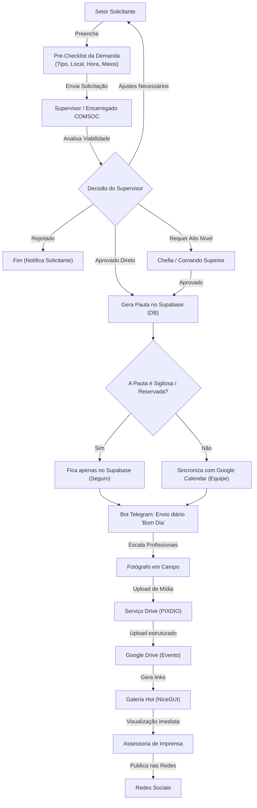

# Projeto de Transformação: COMSOC_IA / COMCIA

Este plano detalha a reestruturação e adaptação do sistema atual (SisCOMCA) para transformá-lo em uma plataforma de **Comando, Controle e Produção para Comunicação Social (COMSOC)**. A nova ferramenta integrará a inteligência artificial, o gerenciamento de pautas/escalas, o módulo de **"Entrega em Hot"** do [PIXDIO_SALLES](file:///X:/PROGRAMACAO/PIXDIO_SALLES), um **Fluxo Bilateral de Demandas** e a **Integração Inteligente com Google Calendar e Alertas Automatizados**.

---

## 🎯 Finalidade do Novo Sistema
O novo **COMSOC_IA** servirá como uma Central de Operações de Mídia e Assessoria, atendendo às seguintes finalidades:
1. **Solicitação de Demandas (Externo/Interno):** Formulário estruturado com **Pre-Checklist de Viabilidade** e Score de Esforço.
2. **Cadeia de Aprovação Bilateral:** Tramitação de pareceres e ajustes entre solicitantes, supervisores e chefia.
3. **Estratégia Híbrida de Agenda (DB + Google Calendar):**
    *   **Supabase (Seguro):** Mantém o banco de dados oficial e centraliza todas as pautas, incluindo as de **alto sigilo/reservadas**.
    *   **Google Calendar (Sincronização Seletiva):** Apenas pautas marcadas como "Públicas" ou "Divulgação Geral" são enviadas para o Google Calendar, mantendo o controle móvel prático da equipe sem vazar dados sigilosos.
4. **Alertas Diários "Bom Dia" & Resumo Semanal:** Envio programado no Telegram com as pautas do dia, escalas e lembretes da semana.
5. **Entrega em Hot (Módulo PIXDIO):** Upload em campo para o Google Drive e galerias automáticas de pré-visualização.
6. **Controle Simplificado de Equipamento (Cautela):** Registro rápido de retirada/devolução de câmeras e baterias atreladas às pautas.

---

## 🗺️ Fluxograma do Ecossistema e Cadeia de Aprovação

---

## 📋 Detalhes do Fluxo de Demandas e Integrações

### 1. Estratégia Híbrida de Agenda (Google Calendar vs. DB)
*   **Segurança da Informação:** Eventos estratégicos de comando, visitas sigilosas e coberturas especiais de inteligência não podem subir para o ecossistema público do Google. Por isso:
    *   No cadastro da pauta aprovada, haverá um campo de seleção: `[ ] Tornar Pauta Pública (Sincronizar Google Calendar)`.
    *   Se marcado como privado/sigiloso, a pauta reside puramente na tabela do Supabase (`pautas_cobertura`), acessível apenas pelos operadores e chefias com login autenticado no painel NiceGUI.
    *   Se marcado como público, o sistema aciona a API do Google para sincronizar automaticamente com a agenda da COMSOC.

### 2. Alertas Automatizados de Rotina (Telegram Cron)
*   **"Bom Dia, COMSOC":** Todos os dias às 07:30 (horário configurável), o bot envia uma mensagem estruturada no grupo interno:
    > 🌅 **BOM DIA, COMSOC!**
    > 📅 **Hoje: 22/07/2026**
    > 
    > 📸 **PAUTAS DO DIA:**
    > 1. **Cerimônia de Passagem de Comando**
    >    * 🕒 Hora: 09:00 | 📍 Local: Pátio Principal
    >    * 👥 Equipe: Sgt. Calaça (Foto), Ten. Silva (Vídeo)
    >    * ⚠️ Obs: Presença do Comandante Geral.
    > 
    > 🔋 **CAUTELA DE EQUIPAMENTO:**
    > * Câmera Nikon D850 retirada por Sgt. Calaça.
*   **Resumo Semanal:** Enviado toda segunda-feira de manhã, compilando as pautas aprovadas para os próximos 7 dias para facilitar a logística de transporte e requisições da equipe.

### 3. Controle Simplificado de Cautela (Equipamentos)
*   Para evitar perdas e manter o material pronto (baterias carregadas, cartões limpos):
    *   Associado a cada Pauta, o operador tem o botão de clique rápido `[Retirar Equipamento]` e `[Devolver Equipamento]`.
    *   O supervisor visualiza no painel principal o status instantâneo dos itens de fotografia em uso.

---

## 📂 Estrutura de Banco de Dados Atualizada
*   **`demandas_comunicacao`** (Novo):
    *   `id` (int), `solicitante_nome`, `setor`, `contato`, `titulo_evento`, `data_evento`, `hora_evento`, `local_evento`, `tipo_cobertura` (json), `autoridades`, `score_esforco`, `sigiloso` (boolean), `status` (text).
*   **`demandas_historico_tramitacao`** (Novo):
    *   `id` (int), `demanda_id` (int), `data_hora` (timestamp), `usuario` (text), `acao` (text), `parecer` (text).
*   **`cautela_equipamentos`** (Novo):
    *   `id` (int), `equipamento` (text), `retirado_por` (text), `data_retirada` (timestamp), `data_devolucao` (timestamp), `pauta_id` (int), `status` (text).
*   **`equipe_comsoc`** (antiga `Alunos`): Cadastro da equipe.
*   **`pautas_cobertura`** (antiga `presenca_ausencia`): Registro de coberturas vinculadas às demandas aprovadas.
*   **`escalas_cobertura`** (antiga `escala_diaria`): Escala de cobertura.
